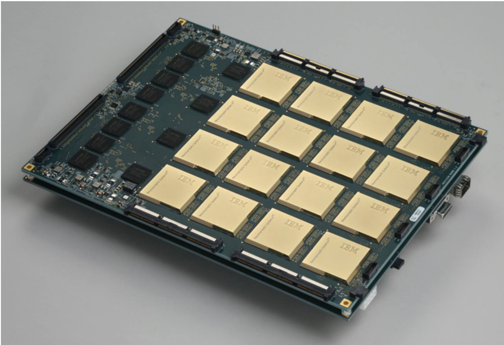
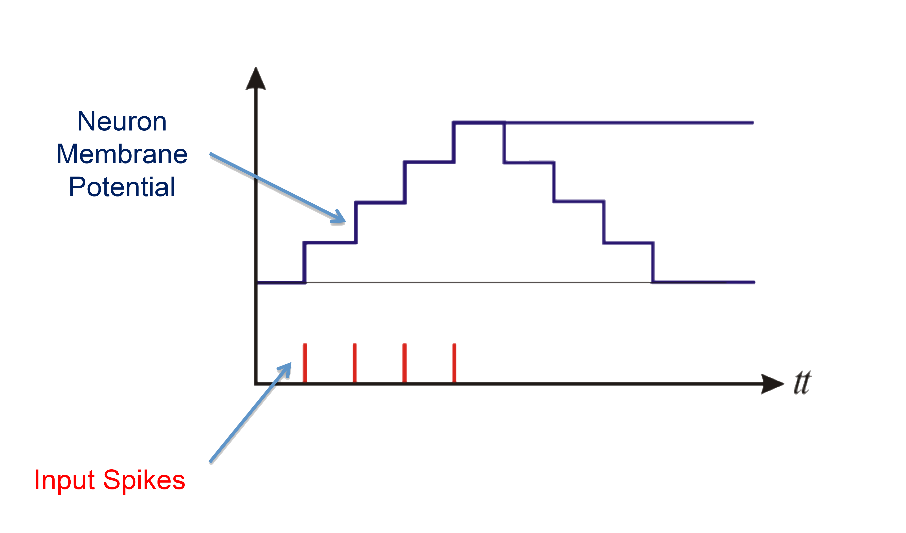

## Neuromorphic Computation
### New Computing Models
Neuromorphic computing is based on spiking neural networks
- Based on Artificial Neural Network (ANN) concept
- Third generation neuron simulations
- Designed to simulate biological functions
	- Initially not for general computation

 

## Spiking Neurons
Unlike a traditional Neural Network Neuron:
- Include concept of time 
	- State changes over a series of time-steps.
- Neurons do not need to fire at every time-step $t$
- Activation level is increased with input spikes

## A Brief History of Spiking Neurons
- First scientific model developed in 1952 by Hodgkin and Huxley
- Commonly used models include:
    + Hodgkin and Huxley Model
    + Integrate and Fire
    + Leaky Integrate and Fire
    + Izhikevich's Simple Neuron Model
    + Many More

## Naming Conventions
Spiking neural networks use bio inspired terms

## Neuromorphic Hardware
"Non von Neumann" computation
- Does not operate using traditional algorithms
- Tiny power requirements: <= 60 mW

### Current Hardware

- Current hardware uses spiking neurons
    - Neurons output a 1 or 0
    - Integration is generally simple (no sigmoid functions yet) 
    - Significant research is underway

### True North Chip

Implementation of an enhanced Leaky Integrate and Fire neuron

##Leaky Integrate-and-Fire
## A Basic Spiking Neuron Model

### Leaky integrate-and-fire:
$$V\_j(t) =  V\_j(t-1) \sum_{i=0}^{n-1} \left[ x_i(t) \, s_i \right]$$

- Takes the sum of all of the input synapses.
    - $x$ is the on/off state of the synapse
    - $s_i$ is the synapse weight
    - $V_j(t)$ is the neuron voltage at time $t$

### Leaky integrate-and-fire
*Leak and reset for neuron $j$:*

- Leak: <!-- .element: class="fragment roll-in visible current-fragment" data-fragment-index="1" -->
$$V_j(t) = V_j(t) - \lambda_j $$
- Spike & Reset: <!-- .element: class="fragment roll-in visible current-fragment" data-fragment-index="3" -->
\begin{align}&\textbf{if}~~V\_j(t) \geq \alpha\_j: \notag \\\\&\qquad \text{Spike}\notag \\\\ &\qquad V\_j(t)= R\_j \notag \\\\ &\textbf{end if} \notag \end{align}

- $\lambda_j$ is the leak value of the neuron.  <!-- .element: class="fragment roll-in visible current-fragment" data-fragment-index="1" -->
- $\alpha_j$ is the threshold of the neuron. <!-- .element: class="fragment roll-in visible current-fragment" data-fragment-index="3" -->
- $R_j$ is the reset voltage. <!-- .element: class="fragment roll-in visible current-fragment" data-fragment-index="3" -->

### Leaky integrate-and-fire
The Combined Formula

**Integration:**
$$V\_j(t) =  V\_j(t-1) \sum_{i=0}^{n-1} \\left[ x\_i(t) \, s\_i \\right]$$

**Leak:**
\begin{equation}
        V_j(t) = V_j(t) - \lambda_j   \notag
\end{equation}

**Threshold check & Fire:**
\begin{align}&\textbf{if}~~V\_j(t) \geq \alpha\_j: \notag \\\\&\qquad \text{Spike}\notag \\\\ &\qquad V\_j(t)= R\_j \notag \\\\ &\textbf{end if} \notag \end{align}

###In Practice

