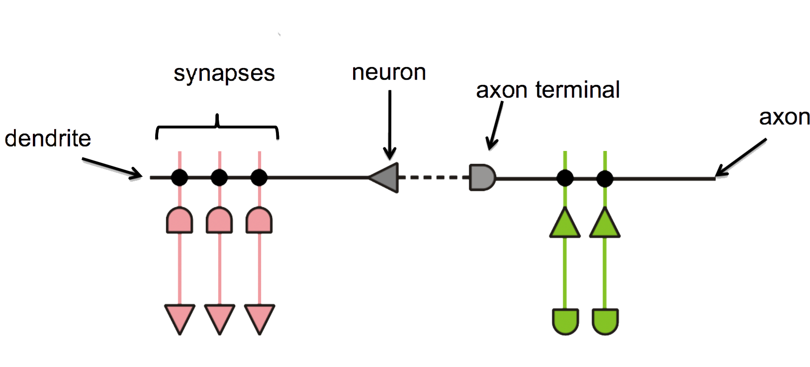

## Neuromorphic Computation
### New Computing Models
Neuromorphic computing is based on spiking neural networks
- Based on Artificial Neural Network (ANN) concept
- Third generation neuron simulations
- Designed to simulate biological functions
	- Initially not for general computation

 

## Spiking Neurons
Unlike a traditional Neural Network Neuron:
	- Include concept of time 
		- State changes over a series of time-steps.
	- Neurons do not need to fire at every time-step $t$
	- Activation level is increased with input spikes
<!-- .element: class="stretch" width="50%" -->
<!-- .element: class="stretch" width="50%"-->

## A Brief History of Spiking Neurons
- First scientific model developed in 1952 by Hodgkin and Huxley
- Commonly used models include:
    + Hodgkin and Huxley Model
    + Integrate and Fire
    + Leaky Integrate and Fire
    + Izhikevich's Simple Neuron Model
    + Many More

## Naming Conventions
Spiking neural networks use bio inspired terms

## Neuromorphic Hardware
"Non von Neumann" computation
- Does not operate using traditional algorithms
- Tiny power requirements: <= 60 mW

