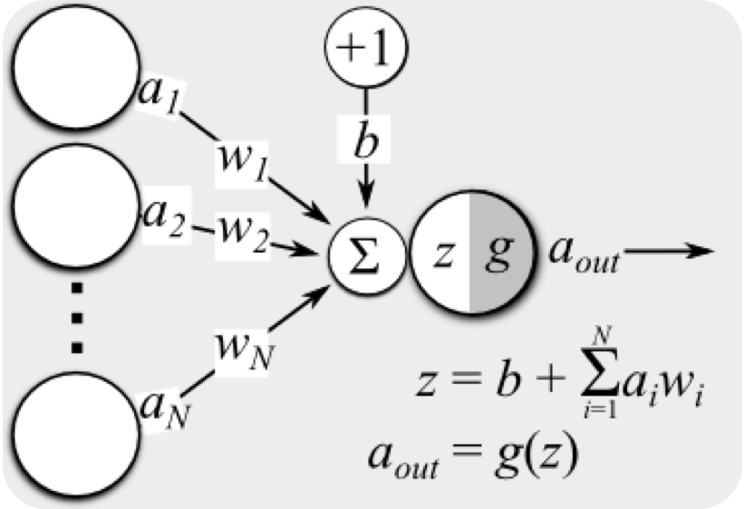
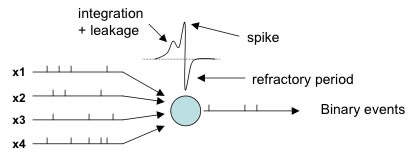

## Neuromorphic Hardware
### Specialized Processing

- Uses Artificial Neural Network concepts
- Excellent for finding patters in data
- Great data analysis capability
Note:
I'm not going to go into too much detail here as Noah discussed this in more detail last meeting.
Neuromorphic hardware allows for specialized data classification and analysis.

## Neuromorphic Hardware
### Low Power

- IBM TrueNorth processor uses 65 mW
	*(That's Milliwatts!)*

Note:
The interesting thing about this hardware, to our research group, is the
power usage. This is a tiny amount of power usage.
As designs improve - perhaps we will have neuromorphic hardware in smartphones!

## Neuromorphic Hardware
### New Algorithms
Neuromorphic computing is "Non von Neumann"
- Does not operate using traditional algorithms
- New programming paradigms needed for adoption

Note:
Programming the hardware is tricky.
We probably won't be seeing a GCC compiler for TrueNorth for a while
IBM has provided a couple of programming tools:
TEA and corelets.

## Demand and Potential
#### Exascale Computing
-	Transitioning to “Fat Nodes”
-	Titan
	- Released in 2013 has 18,688 CPUs and 18,688 GPUs        
  - Uses 8.2 MW of Power
	- 10 petaflops
- Tianhe-2 has 32,000 CPUs with accelerators
	- 33.86 petaflops
	- Uses 24 MW of Power!

#### NASA vision report suggests in 2030:
-   New systems will have only 20,000 compute nodes
-   New systems will *need* accelerator cards
Note:
As new supercomputer demands are met, the power requirements have gone up.
The NASA report suggests that by 2030 new supercomputers will only have about 20,000 compute nodes
How will we achieve exascale performance with fewer nodes?

### Exascale Computing
-   Accelerator cards are becoming increasingly important
-   GPU, Intel PHI
-   Why not neuromorphic hardware?  <!-- .element: class="fragment roll-in visible current-fragment" data-fragment-index="1" -->
       - Low Power  <!-- .element: class="fragment roll-in visible current-fragment" data-fragment-index="1" -->
       - Excellent Machine Learning  <!-- .element: class="fragment roll-in visible current-fragment" data-fragment-index="1" -->
Note:
Supercomputers will have to make use of more dedicated acceleration technology
So - why not neuromorphic hardware as well?

## Designing the Next Generation Supercomputers

### Simulation of New Technologies
-   Allows testing of hardware configurations
-   Enables rapid prototyping of systems

### CODES
-		Based on ROSS
-		Enables simulation of new supercomputer designs

### Neuromorphic Hardware Simulation
-   Should Allow for Chip Simulation 
          
          
#### Needs to simulate
-   Current hardware design
-   Future and theoretical hardware

# Contributions
### NeMo – An Open Source Neuromorphic Hardware Simulation Model

## NeMo
#### Design and implementation
-   Implemented using ROSS
-   Event-Driven
-   Massively Parallel
-   Optimistic Event Scheduling
-   Supports Reverse Computation

### NeMo
-	Open Source
-	Flexible Hardware Models
-   Supports current neuromorphic design
-   Can simulate novel designs
-   Can even simulate currently "impossible" designs

### NeMo
#### Large Scale Simulation Support
-   Currently tested to simulate 65,536 neurosynaptic cores
-   Further scale-ups very feasible

### NeMo
#### Potential for new spiking neuron models
-   Will support other Spiking Neural Network models in the future
-   Validated using IBM’s TrueNorth Model

# Neuromorphic Computing Models
## A brief overview

### Basics
-	Based on Artificial Neural Network (ANN) concept
-	Third generation neuron simulation
- Developed to simulate biological functions - not for machine learning
- Neuromorphic computing has been shown to be viable for computing

## ANNs and MLPs
- ANNs (Artificial Neural Network)s are:
	- Machine Learning Concepts
	- Inputs are modified by weights
	- Neurons sum inputs and apply output functions
	- Output is result of this function

## ANNs and MLPs
- MLPs (Multi Layer Perceptron)s are:
	- Multiple layers of perceptron neurons
	- The basis for many ANN network designs
	- Hugely popular

## Spiking Neurons
- Include concept of time
- Neurons do not need to fire at every time-step, $t$
- Activation level is increased with spikes

<!-- .element: class="stretch" width="50%"-->

http://lis2.epfl.ch/CompletedResearchProjects/EvolutionOfAdaptiveSpikingCircuits/<!-- .element: class="reference_footnote" -->

## A Brief History
-	First scientific model developed in 1952 by Hodgkin and Huxley
- 	Developed further into commonly used models including:
	- Hodgkin and Huxley model
	- Integrate and fire
	- Leaky integrate and fire
	- Many more...

## Naming Conventions
Spiking neural networks use bio inspired terms

